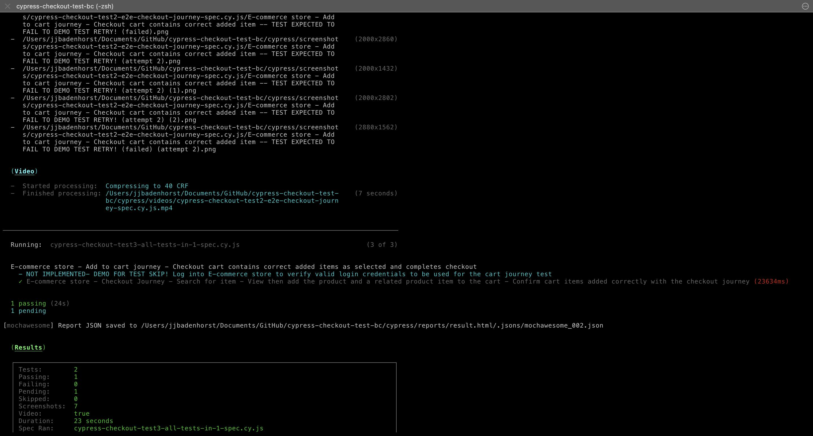

# E-commerce checkout journey tests showcasing the use and implementation of [__Cypress__](https://www.cypress.io/) as a __Test Framework__

> This repo contains Cypress tests for an e-commerce store checkout journey with the [__"Test Automation - Big Cartel E-commerce Test store"__](https://testautomation.bigcartel.com/) to showcase the Cypress Test Framework

## Project information

### This project contains two Cypress functional journey tests for multiple specs to verify:

> E-commerce store - Checkout Journey executed on the [__"Test Automation - Big Cartel E-commerce Test store"__](https://testautomation.bigcartel.com/) with test steps to showcase:  

- Searching for the item in the store
- Viewing the product from the results returned in the search
- Choosing __colour__ option from a dropdown selection
- Choosing __age__ option from a dropdown selection
- __Increasing the quantity__ of items
- Proceeding to the __cart__
- Asserting and verifying items added to cart in the checkout cart for:
  - *correct items*
  - *options selected*
  - *quantities*
  - *cart item prices*
  - *cart totals*

### With specific Cypress configs and test code showcasing for:

- The use of __Fixtures__ with test data support
- The use of __Selectors__ support
- __Screen capture__ support for all passed commands
- [__MochAwesome reporter__](https://www.npmjs.com/package/mochawesome) - for test run __report generation__
- Test run __Video with compression__ support
- __Failed test retry__ support
- __Skipping tests__ support
- __Multiple specs__ run

## Pre-requisites

1. [__NodeJS installed__](https://nodejs.org/en/download/)
2. [__npm installed__](https://docs.npmjs.com/downloading-and-installing-node-js-and-npm/)

## Setup to run the test suite

1. Clone this repository or download the zip and extract it
2. Go to the extracted [__test data__](cypress/fixtures/testdata.json) file: `cypress/fixtures/testdata.json` to view the *test data* *(current e-commerce store not supported/not implemented)*
3. Open your terminal to the root directory of the project *(cypress-checkout-test)* and run `npm install` command in the terminal/cli to install all dev dependencies

- Expected (Successful) - `npm install` terminal output sample:


4. Execute all tests from the CLI with `npx cypress run` *(will run headless)* or with available script options `npm run {script option}`:
```js
/**
* Available npm runner script options: 
*
* testWithBrowser       - Run tests headed in the Cypress default Electron browser
* testWithChrome        - Run tests headed in Chrome browser
* testWithFF            - Run tests headed in Firefox browser
* testHeadless          - Run tests headless
* testWithBrowserNoExit - Run tests headed with the Cypress runner remaining open after the test run
*                        - Note: Test run video recording will keep recording until Cypress runner is closed/killed when @testWithBrowserNoExit option is used!
*/

npm run testWithBrowser
npm run testWithChrome        
npm run testWithFF
npm run testHeadless          
npm run testWithBrowserNoExit

/**
* Available npx cypress runner  options: 
*
* npx cypress run --headed --browser [installed browser name: chrome/firefox/edge/safari]
*/

npx cypress run --headed --browser edge

```
5. When the test run completed:
- [__Test results report__](cypress/reports/result.html/index.html) will be generated in the `cypress/reports/result.html/index.html` path
- [__Video recordings__](cypress/videos/) of the runs will be generated in the `cypress/videos/` path
- [__Screenshots__](cypress/screenshots/) will be generated in the `cypress/screenshots/` path for all test steps set to take screenshots

## Expected (Successful - Retried - Skipped) test run samples:

1. __Successful Run sample__ - Cart checkout page in Cypress runner with Electron browser:


2. __Successful Run sample__ - Terminal/CLI output:





3. __Successful Run sample__ - Cypress Test Results from the HTML report with passed test results output:


4. __Successful Run sample__ - Video recordings with no failures *(no test retry)*

https://user-images.githubusercontent.com/3204581/203672678-b5509689-fae0-4e53-a980-c43bc7a5c4a2.mp4

5. __Successful Run sample__ - Video recording with *failed test retry*

https://user-images.githubusercontent.com/3204581/203673150-3b41a1c1-4a35-4115-8901-07a6696a4715.mp4

6. __Run sample__ - [Cypress Cloud Runner](https://cloud.cypress.io)
- [*Requires cypress cloud key to run*](https://docs.cypress.io/faq/questions/cloud-faq)


## Gotchas

#### 1. `npm install` __Node package install hangs *for 5+ mins* then throws error__ `ECONNRESET network error`

```js
Npm install : FetchError: request to http://registry.npmjs.org/... failed, reason: read ECONNRESET
```

__Troubleshooting to resolve the npm js FetchError__
- Could be your internet connection: Hotspot/tether/connect to a reliable internet connection and re-run `npm install` to see if it still fails *or...*
- Add a host entry for registry.npmjs.org: `ping registry.npmjs.org` to obtain the IP address then update `/etc/hosts` with the IP address E.g. `104.16.20.35 registry.npmjs.org` and re-run `npm install` *or...*
- Run `npm config edit` and clear out the `.npmrc` file, save it and clean out the cache with `npm cache clean -f` then re-run `npm install` *or...*
- Could be a proxy issue in your network that needs to be resolved - [*reference npm config docs to configure proxy settings*](https://docs.npmjs.com/cli/v8/using-npm/config#proxy)

#### 2. __Cart page empty on view cart__

- required the e2e `experimentalSessionAndOrigin` to be set to `false` in *config.js*
  
```js
// Extract from cypress.config.js (this is already configured by default)
e2e: {
  experimentalSessionAndOrigin: false
}
```

#### 3. __Remove output folder errors__

```js
// The error we received was: Error: EACCES: permission denied

Remove output folder /Users/user_folder_here/Documents/Code/cypress-checkout-test-bc/cypress/reports/result.html
An error was thrown in your plugins file while executing the handler for the before:run event.
The error we received was: Error: EACCES: permission denied,
rmdir '/Users/user_folder_here/Documents/Code/cypress-checkout-test-bc/cypress/reports/result.html' account_user_name_here cypress-checkout-test-bc % 

// We failed to trash the existing run results...."DS_Store" couldn't be moved to the trash because you don't have permission to access it.

We failed to trash the existing run results. This error will not affect or change the exit code.
Error: Command failed: /Users/user_folder_here/Library/Caches/Cypress/13.6.2/Cypress.app/Contents/Resources/app/node_modules/trash/lib/macos-trash /Users/user_folder_here/Documents/Code/cypress-checkout-test-bc/cypress/screenshots/.DS_Store ".DS_Store" couldn't be moved to the trash because you don't have permission to access it.
at ChildProcess.exithandler (node:child_process:430:12) at ChildProcess.emit (node:events:513:28)
at maybeClose (node:internal/child_process:1091:16) at Socket. (node:internal/child_process:449:11)
at Socket.emit (node:events:513:28) at Pipe. (node:net:322:12)

```
__Resolving the permission denied Errors__

- `chmod` the cypress folder and provide read and write access

```js
// chmod the cypress project folder:
sudo chmod -R 775 /Users/user_folder_here/Documents/Code/cypress-checkout-test-bc/cypress/
// chmod the Application Support Cypress folder:
sudo chmod -R 775 /Users/user_folder_here/Library/Application\ Support/Cypress
```

## Future work planned - *TODOs*

1. Implementing Login using a cookie to emulate a test start from a logged-in session state *(May require an updated e-commerce store to test against)*
2. Implement [cypress-image-compare pixel diff tests](https://www.npmjs.com/package/cypress-image-compare)
3. __Containerisation__ for a containerised __demo e-commerce shop__ and  a __Cypress Docker/Kubernetes__ instance(s):
- Create a [containerised workflow with docker](https://www.docker.com/) or
- Azure or
- AWS/Amazon
4. Cypress test kick-off/run with CI/CD in:
- [GitHub Actions](https://docs.cypress.io/guides/continuous-integration/github-actions#What-you-ll-learn) or
- [Jenkins](https://www.jenkins.io/) or
- [Circle CI](https://circleci.com/)
5. Database integration to showcase test run setups and tear-downs
6. Improve Building the project in NodeJS with npm and grunt
